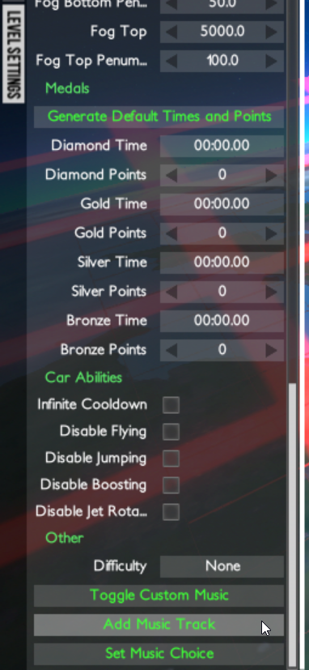
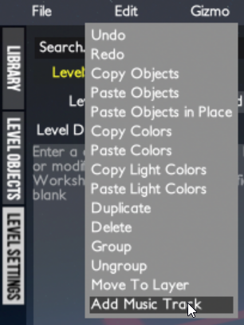
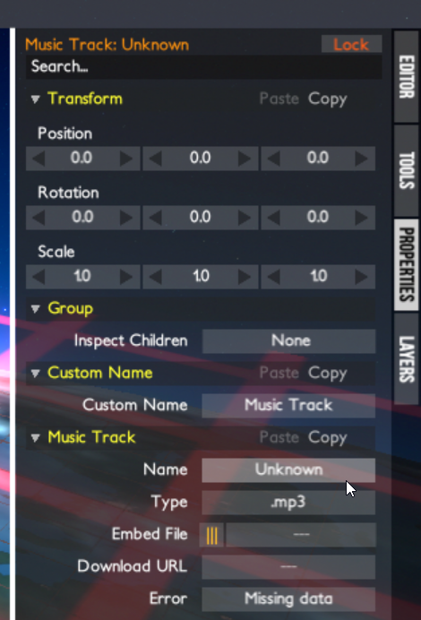
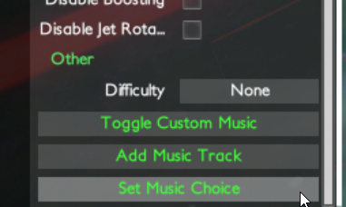
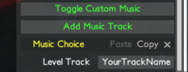

# Distance TrackMusic

TrackMusic allows you to include music with your levels that will play for other users of the mod.

Features:

* Custom level-wide/global music
* Custom music on trigger
* Embed music in the level file
* Download music from a URL
* Provide fallback official music for users without the mod
* Music visualization

---

## Installation

1. Install [Spectrum](https://github.com/Ciastex/Spectrum/releases)
2. Open your Distance folder, then navigate to Distance_Data -> Spectrum -> Plugins. Your Distance folder is likely located at `C:\Program File (x86)\Steam\steamapps\common\Distance`
3. Download [TrackMusic](https://github.com/Corecii/Distance-TrackMusic/releases)
4. Open the zip file and place the "CustomTrackMusic" folder inside the "Plugins" folder from step 2.

---

## Try It Out!

The very short [Music Test](https://steamcommunity.com/sharedfiles/filedetails/?id=1901418583) level includes a custom global music track and a triggered music track. The music tracks are embedded in the level file and will play automatically if you have the mod installed.

---

## How to for Players

Just play! If a level includes custom music, it will play automatically.

Levels with download URLs for music can take up to 20 seconds to download. The game will stay on the loading screen at 0% while the music downloads.

---

## How to for Creators

1. Add a custom music definition with one of the "Add Music Track" buttons, either at the bottom of Level Settings or in the Edit menu.

 

2. Set your track name and embed a music file. You can browse for a file with the orange button on the left.

3. Set your custom music choice on LevelSettings or a MusicTrigger. Enter your track name from step 2.

Your embedded music file will now play for mod users, even when they download from the Steam Workshop!

### Tips

* You can switch between custom and official music with the "Toggle Custom Music" buttons in the Level Settings and File menu.
* Try to keep the final level size down. You can cut down audio files in Audacity if they're unnecessarily long. You can also re-encode them at a lower quality if you feel that it's necessary.
* Only `.mp3`, `.wav`, and `.aiff` are supported.
* If you stop using the mod, you can still re-publish with music data intact. Music data is stored as Event Listeners in specific objects in the map.
* Sometimes you need to load a level twice to get rid of the previous Music Choice in Level Settings (or to load the new one properly).
* The "Toggle Custom Music" state persists outside the level editor. Be sure to turn custom music back on before leaving the editor!